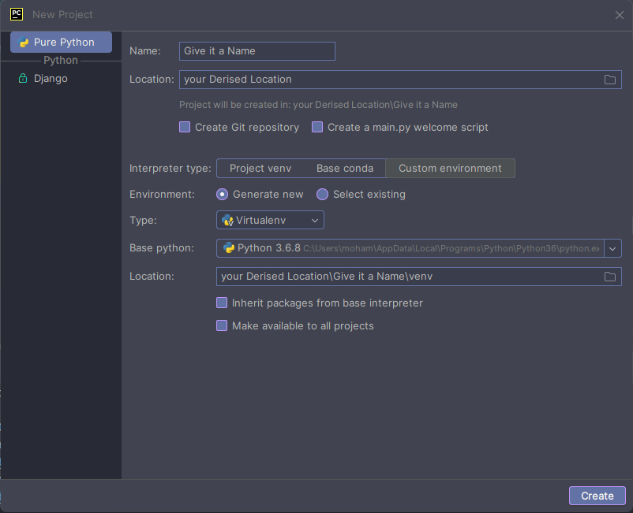

# Notes 📝

A Simple user friendly web app built with [Flask], [Bootstrap] and [Sqlite].

## Technologies used

- [Flask]
- [Sqlite]
- [BootStrap]

---
## Project Structure

This Project uses Sqlite for Database, Flask for back-end and Bootstrap to CSS

Inside this project you'll see the following directory structure:

```bash
├── templates/
│   └── apology.html
│   └── edit.html
│   └── index.html
│   └── layout.html
│   └── login.html
│   └── new.html
│   └── register.html
│   └── view.html
└── static/
│   └── icon.ico
│   └── img.png
│   └── notes.ico
│   └── styles.css
└── app.py
└── helpers.py
└── entry.db
└── requirements.txt
```
- `/templates`: Here is where our app's templates reside.
- `/static`: Here is where our app's icon and CSS reside.
- `app.py`: This is where our Flask app & route source
            code lives.
- `helpers.py`: Helper function exists here.
- `entry.db`: This is our Sqlite database.

---

## How to Run on your computer

Download [Pycharm].<br>
Create a New Project with Custom Environment.<br>
After Creating the project Copy Paste the files provided above.



### Install Dependencies

Open Terminal and Run the following command, 

```bash
pip install -r requirements. txt
```
---

## Run the Web Application

Right-click anywhere on the editor and select **Run 'app'** from the context menu.
Click the link it shows in Terminal to go to the Web Application


[Sqlite]: https://www.sqlite.org/
[Flask]: https://flask.palletsprojects.com/en/3.0.x/
[BootStrap]: https://getbootstrap.com/
[Pycharm]: https://www.jetbrains.com/pycharm/?var=1
